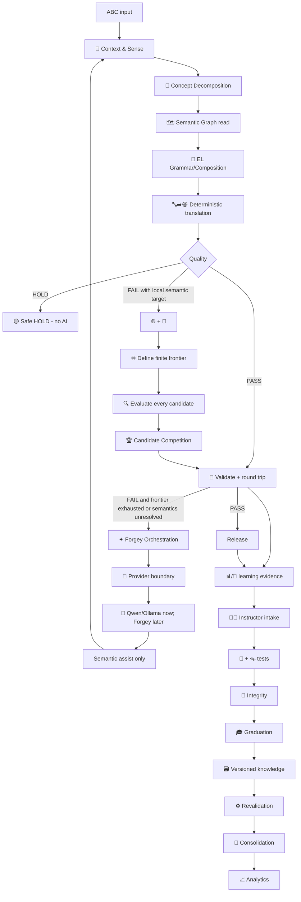

# EL Bot — Phase 1 Architecture & Engine Contracts

**Status:** ✅ PHASE 1 ARCHITECTURE IMPLEMENTED — **NO NEW LANGUAGE/AI/LEARNING ENGINE BEHAVIOR IMPLEMENTED**

**Authority date:** 2026-08-12

**Purpose:** Reconcile the 24 source-present engines with the 20 Owner-locked planned engines, remove responsibility ambiguity, define provider/learning/search boundaries, and establish a machine-checkable 44-engine target contract.

> This document is an architecture contract. `source-present` means an engine file already exists. `planned-only` means the engine is specified here but has no implementation yet. Phase 1 does not authorize Phase 2 behavior.

## 1. Non-negotiable architecture rules

1. Deterministic-first remains permanent.
2. `HOLD` does not trigger AI.
3. AI escalation is permitted only after a genuine deterministic `FAIL` under the failure contract below.
4. `🔤➡️😀` must never directly import/call Ollama, Qwen, Forgey, or any provider adapter.
5. `✦` owns escalation policy; `🔌` owns adapter connectivity/invocation; provider adapters are not engines.
6. Raw AI text can never be released as Emoji Language.
7. AI assistance should resolve semantics first; final EL remains deterministic/search/validation authority.
8. `📚501` is a canonical-vocabulary count, not the Emoji Universe limit.
9. Complete Candidate Search means complete for the declared finite frontier only; silent heuristic pruning is forbidden.
10. Learning requires provenance + evidence + validation + integrity + graduation. One AI answer can never canonize knowledge.

## 2. 44-engine registry

| ID | Display | Runtime | Engine | State | Primary ownership |
|---|---:|---:|---|---|---|
| E01 | ⚙️ | ⚙️ | Core Engine | source-present | EL surface parsing |
| E02 | 📚 | 📚 | Vocabulary Engine | source-present | canonical EL vocabulary membership |
| E03 | 🧠 | 🧠 | Intelligence Engine | source-present | deterministic interpretation of canonical EL structure |
| E04 | 🧾 | 🧾 | Validation Engine | source-present | release validation report |
| E05 | 🧵 | 🧵 | Session Engine | source-present | in-memory session turns |
| E06 | 💾 | 💾 | Persistence Engine | source-present | session/runtime persistence |
| E07 | 🧪 | 🧪 | Diagnostics Engine | source-present | system diagnostics |
| E08 | 🖥️ | 🖥️ | UI Engine | source-present | user interaction surface |
| E09 | 🔁 | 🔁 | Workflow Engine | source-present | top-level runtime sequencing |
| E10 | 📡 | 📡 | Event Engine | source-present | runtime event/signal telemetry |
| E11 | 🔐 | 🔐 | Security Engine | source-present | command-boundary authorization |
| E12 | 🧯 | 🧯 | Recovery Engine | source-present | safe recovery boundary |
| E13 | 🎛️ | 🎛️ | Configuration Engine | source-present | runtime configuration toggles |
| E14 | 🔌 | 🔌 | Connector Engine | source-present | provider/adapter registration |
| E15 | ✦ | ✦ | Forgey Orchestration Engine | source-present | intelligence escalation policy |
| E16 | 🧑‍🏫 | 🧑‍🏫 | Instructor Engine | source-present | canonical semantic instruction/readout |
| E17 | 🎞️ | 🎞️ | Animation Engine | source-present | processing animation state |
| E18 | 🛡️ | 🛡️ | Reliability Engine | source-present | runtime reliability aggregation |
| E19 | 🔔 | 🔔 | Notification Engine | source-present | in-memory notifications |
| E20 | 🪪 | 🪪 | Identity Engine | source-present | local EL Bot system identity/protocol identity |
| E21 | 🛂 | 🛂 | Authentication Engine | source-present | local bot protocol authentication |
| E22 | 🔄 | 🔄 | Updater Engine | source-present | explicit local app/protocol update state |
| E23 | 🔤➡️😀 | 🔤➡️😀 | ABC → Emoji Engine | source-present | deterministic ABC-to-EL translation attempt |
| E24 | 😀➡️🔤 | 😀➡️🔤 | Emoji → ABC Engine | source-present | deterministic EL-to-ABC translation attempt |
| N01 | 🌐 | 🌐 | Emoji Universe Engine | planned-only | investigable emoji universe specification |
| N02 | 🔍 | 🔍 | Complete Candidate Search Engine | planned-only | evaluate every candidate in declared finite search space |
| N03 | 🧩 | 🧩 | Concept Decomposition Engine | planned-only | decompose source concepts into semantic components/roles/functions |
| N04 | 🗺️ | 🗺️ | Semantic Graph Engine | planned-only | concept/sense relationship graph |
| N05 | 📊 | 📊 | Evidence & Confidence Engine | planned-only | positive/negative evidence records |
| N06 | 🎓 | 🎓 | Knowledge Graduation Engine | planned-only | knowledge maturity transitions |
| N07 | 🧪 | 🧫 | Experiment Engine | planned-only | controlled semantic/mapping experiments across contexts |
| N08 | 🏆 | 🏆 | Candidate Competition Engine | planned-only | compare/rank surviving candidates |
| N09 | 🧬 | 🧬 | Generalization Engine | planned-only | derive reusable semantic/translation rules from validated examples |
| N10 | 🛡️ | 🧿 | Knowledge Integrity Engine | planned-only | knowledge consistency checks |
| N11 | 🔄 | ♻️ | Revalidation Engine | planned-only | retest affected learned knowledge |
| N12 | 📈 | 📈 | Learning Analytics Engine | planned-only | learning metrics |
| N13 | 🧭 | 🧭 | Context & Sense Disambiguation Engine | planned-only | contextual sense selection |
| N14 | 🧱 | 🧱 | EL Grammar & Composition Engine | planned-only | EL grammar/composition rules |
| N15 | 🧷 | 🧷 | Emoji Canonicalization Engine | planned-only | Unicode emoji normalization |
| N16 | ♾️ | ♾️ | Search Frontier & Exhaustion Engine | planned-only | finite frontier specification |
| N17 | 📜 | 📜 | Provenance Ledger Engine | planned-only | origin/history of learned claims |
| N18 | 🪤 | 🪤 | Counterexample & Adversarial Semantics Engine | planned-only | failure-seeking semantic tests |
| N19 | 🗃️ | 🗃️ | Knowledge Versioning & Rollback Engine | planned-only | knowledge snapshots |
| N20 | 🧹 | 🧺 | Knowledge Consolidation Engine | planned-only | deduplicate/consolidate compatible knowledge |

### Runtime-marker collision resolutions

| Approved display name | Conflict | Runtime contract | Resolution |
|---|---|---|---|
| 🧪 Experiment Engine | 🧪 is Diagnostics | 🧫 | Diagnostics keeps 🧪; semantic experiments use 🧫 |
| 🛡️ Knowledge Integrity Engine | 🛡️ is Reliability | 🧿 | Reliability stays observational; knowledge consistency uses 🧿 |
| 🔄 Revalidation Engine | 🔄 is Updater | ♻️ | App/protocol update stays 🔄; knowledge revalidation uses ♻️ |
| 🧹 Knowledge Consolidation Engine | 🧹 is existing clear action | 🧺 | Clear remains 🧹; knowledge consolidation uses 🧺 |

## 3. Responsibility boundaries that remove the dangerous overlaps

### 🧪 Diagnostics vs 🧫 Experiment
- **Diagnostics:** Is the system/engine healthy and behaving according to tests?
- **Experiment:** Does a semantic mapping/rule survive controlled contextual trials?
- Experiment evidence may be consumed by learning; Diagnostics must never mutate semantic knowledge.

### 🛡️ Reliability vs 🧿 Knowledge Integrity
- **Reliability:** Summarizes supplied runtime/translation metrics.
- **Knowledge Integrity:** Detects contradiction, poisoning, drift, and invalid knowledge evolution.
- Reliability never promotes/demotes knowledge; Integrity never masquerades as runtime health.

### 🔄 Updater vs ♻️ Revalidation
- **Updater:** App/local protocol version state only.
- **Revalidation:** Retest learned language knowledge only.
- Neither owns the other's migrations or version numbering.

### 💾 Persistence vs 🗃️ Knowledge Versioning
- **Persistence:** Session/runtime state.
- **Knowledge Versioning:** Vocabulary/graph/grammar/learning snapshots and rollback.
- Session save/load must never become canonical-language version control.

### 📡 Event vs 📜 Provenance
- **Event:** Runtime telemetry/signal sequence.
- **Provenance:** Auditable origin/history of learned claims and decisions.
- Runtime events can feed provenance, but an event is not by itself learning evidence.

### 🔁 Workflow vs ✦ Forgey Orchestration
- **Workflow:** Top-level product/runtime sequencing.
- **Forgey Orchestration:** Only external-intelligence escalation policy and provider-neutral assist routing.
- Workflow may call ✦; Workflow must not reproduce ✦ policy.

### 🔌 Connector vs provider adapters
- **Connector:** registration, probe evidence, invocation boundary.
- **Ollama/Qwen adapter:** temporary provider implementation; **not one of the 44 engines**.
- **Future Forgey adapter:** replacement provider implementation behind the same connector contract; also not counted as a language engine.

### 🧑‍🏫 Instructor vs 🎓 Graduation
- **Instructor:** canonical instruction/readout + intake/coordinator for learning evidence.
- **Graduation:** the only maturity/promotion/demotion authority.
- Instructor cannot silently write a candidate into canonical vocabulary.

### 📚 Vocabulary vs 🌐 Emoji Universe
- **Vocabulary:** what EL currently knows/authorizes.
- **Emoji Universe:** what EL is allowed to investigate.
- A universe member is not automatically canonical vocabulary.

### 🔍 Search vs ♾️ Frontier vs 🏆 Competition
- **Frontier:** defines/enumerates/checkpoints a finite space and proves exhaustion.
- **Search:** actually evaluates every candidate in that declared space.
- **Competition:** ranks survivors; it does not claim search completeness.

## 4. Canonical data contracts

| Contract | Owner | Required meaning |
|---|---|---|
| `ELSurface` | ⚙️ Core | Parsed grapheme/token surface with base status |
| `CanonicalEmojiUnit` | 🧷 Canonicalization | Stable Unicode-normalized emoji identity |
| `EmojiUniverseSnapshot` | 🌐 Universe | Versioned finite candidate-unit inventory |
| `SenseDecision` | 🧭 Disambiguation | Chosen/preserved source sense with ambiguity evidence |
| `ConceptDecomposition` | 🧩 Decomposition | Roles/actions/entities/states/modifiers/relationships |
| `SemanticGraphFragment` | 🗺️ Semantic Graph | Versioned semantic nodes/edges used for reasoning |
| `ELCompositionTemplate` | 🧱 Grammar | Meaning-preserving structural template, not a winner |
| `SearchFrontier` | ♾️ Frontier | Explicit finite coordinate space, counts, checkpoint, exhaustion state |
| `CandidateEvaluation` | 🔍 Search | One actually-tested candidate plus validation evidence |
| `CompetitionResult` | 🏆 Competition | Ranked survivors + winner/alternatives + score evidence |
| `TranslationAttempt` | 🔤➡️😀 / 😀➡️🔤 | Deterministic result, metrics, PASS/HOLD/FAIL, failure reasons |
| `TranslationFailureEvidence` | 🛡️ Reliability | Normalized failure evidence eligible/ineligible for escalation |
| `SemanticAssistRequest` | ✦ Orchestration | Provider-neutral missing-semantic question + deterministic evidence |
| `SemanticAssistResponse` | ✦ via 🔌 | Provider-originated semantic proposal; never directly releasable EL |
| `ValidationReport` | 🧾 Validation | Releasable/not releasable with surface/vocabulary/semantic checks |
| `EvidenceRecord` | 📊 Evidence | Positive/negative observation + confidence contribution |
| `ProvenanceRecord` | 📜 Provenance | Origin, provider/version, validation lineage, timestamps/version IDs |
| `KnowledgeClaim` | 🧑‍🏫 Instructor intake | Proposed semantic/mapping/rule claim awaiting maturity decision |
| `GraduationDecision` | 🎓 Graduation | Unknown/discovered/provisional/validated/canonical or demotion |
| `KnowledgeVersion` | 🗃️ Versioning | Snapshot lineage + rollback target |
| `RevalidationResult` | ♻️ Revalidation | Retest outcome linked to prior claim/version |
| `LearningMetricEvent` | 📈 Analytics | Read-only learning/AI-dependency metric input |

## 5. Exact deterministic/AI escalation contract

AI is **not** a generic fallback for exceptions, slowness, HOLD, or low confidence alone.

### Eligible escalation
A request becomes AI-eligible only when all are true:
1. The request reached the deterministic language path successfully (no security/runtime/recovery failure).
2. The deterministic translation attempt is `FAIL`, not `HOLD`.
3. The failure contains an unresolved semantic/sense/concept reason **or** a declared local candidate frontier was fully exhausted without a releasable candidate.
4. Local learned knowledge/generalization/context resolution has been consulted where applicable.
5. ✦ receives structured failure evidence and explicitly authorizes escalation.
6. 🔌 reports a real available provider adapter.

### Ineligible escalation
- `HOLD` only.
- Parser/security/authentication/runtime exception.
- UI/animation failure.
- Provider unavailable.
- Search frontier not actually exhausted when exhaustion is required.
- A failure that deterministic repair/recovery owns.

### Provider result rule
Provider output is a **semantic assist proposal**. It must re-enter deterministic context/decomposition/grammar/search/competition/validation/round-trip gates. Raw provider prose or an unvalidated provider-authored EL string cannot reach the user.

## 6. Learning write contract

```text
validated outcome
  → 📜 provenance
  → 📊 positive/negative evidence
  → 🧑‍🏫 learning intake
  → 🧫 experiments
  → 🪤 counterexamples
  → 🧿 integrity
  → 🎓 graduation decision
  → 🗃️ versioned knowledge change
  → ♻️ revalidation hooks
  → 🧺 consolidation
  → 📈 analytics
```

Failed AI results are retained as negative evidence/provenance but are never canonical vocabulary. Passed AI results are evidence, not automatic truth.

## 7. Target translation flow



## 8. Dependency rules

- The machine-readable registry is authoritative for allowed direct engine dependencies.
- `E23` has no direct dependency on `E14`, `E15`, or any provider adapter.
- `E15` may depend on `E14`, but not the reverse.
- Provider adapters are replaceable implementation details and must not appear as engine IDs.
- Knowledge mutation paths must pass through Provenance/Evidence/Integrity/Graduation/Versioning contracts.
- Diagnostics may inspect/test engines but does not own their semantics.
- UI may render status but must not compute translation or learning authority.

## 9. Phase 1 verification gates

Phase 1 is PASS only when the architecture verifier confirms:
- exactly 44 registered engines: 24 source-present + 20 planned-only;
- all IDs are unique;
- all future runtime markers are unique;
- all dependencies refer to registered engines and there are no self-dependencies;
- the target dependency graph is acyclic;
- every existing engine source path exists;
- no planned-only engine is falsely marked source-present;
- the four resolved marker collisions remain locked;
- deterministic-first / FAIL-only escalation / no direct ABC→provider dependency rules remain locked;
- Ollama/Qwen remains a provider adapter rather than a 45th engine;
- planning and implementation state remain explicitly distinguishable.

## 10. Phase boundary

### ✅ Phase 1 may change
- architecture documents
- machine-readable engine contracts
- architecture verification gates
- future interface/dependency specification

### ❌ Phase 1 does not change
- translation behavior
- current 501 canonical vocabulary
- AI fallback wiring
- automatic learning
- Complete Candidate Search runtime behavior
- new engine source implementations
- hourglass/UI polish implementation
- Windows packaging gate

**Next phase after a green Phase 1 gate:** Phase 2 — 🌐📚 Knowledge Foundation.
